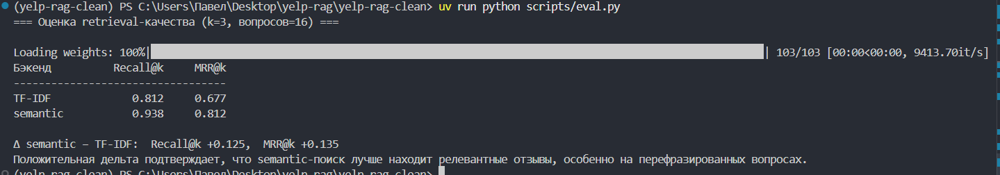
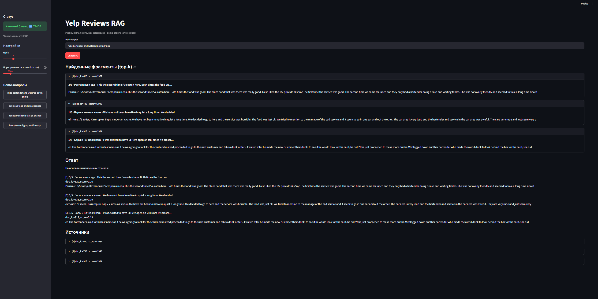

# Yelp Reviews RAG

Учебный Retrieval-Augmented Generation поверх отзывов **Yelp**: данные → чанки →
индекс → поиск → demo-ответ с источниками → Streamlit UI.

Pipeline повторяет архитектуру репозитория-образца
[MaratNotes/rag-tutorial](https://github.com/MaratNotes/rag-tutorial) и расширяет
его двумя улучшениями:

1. **Semantic-поиск** через `sentence-transformers` (рядом с базовым TF-IDF, с
   переключением бэкенда).
2. **Оценка качества (Eval)** — метрики `Recall@k` и `MRR@k` со сравнением
   бэкендов на эталонном наборе вопросов.

## Требования

- Python 3.10+
- [uv](https://docs.astral.sh/uv/)

## Быстрый старт

```bash
# 1. Окружение
uv venv
uv sync

# 2. Подготовка данных: скачать ~5000 отзывов Yelp с Hugging Face
uv run python scripts/prepare_datasets.py --limit 5000

# 3. Сборка индекса (ingest + chunk + TF-IDF + semantic embeddings)
uv run python scripts/build_index.py

# 4. Запуск UI
uv run streamlit run app/main.py
```

Откройте в браузере: http://localhost:8501

> **Офлайн / нет доступа к Hugging Face?**
> Данные: `uv run python scripts/prepare_datasets.py --synthetic --limit 5000`
> сгенерирует реалистичный синтетический корпус того же формата.
> Индекс: если модель эмбеддингов недоступна, `build_index.py` автоматически
> пропускает semantic-индекс и система работает на TF-IDF (см. логику отката).

## Выбор бэкенда поиска

Бэкенд задаётся переменной окружения `RAG_BACKEND` (по умолчанию `semantic`):

```bash
RAG_BACKEND=semantic uv run streamlit run app/main.py   # поиск по смыслу
RAG_BACKEND=tfidf     uv run streamlit run app/main.py   # лексический поиск
```

Если выбран `semantic`, но эмбеддинги не собраны, происходит автоматический
откат на TF-IDF.

## Данные

Подробности — в [doc/DATA.md](doc/DATA.md). Кратко:

- **Источник:** [`Yelp/yelp_review_full`](https://huggingface.co/datasets/Yelp/yelp_review_full)
  (Yelp Dataset Challenge 2015), 650 000 отзывов с оценкой 1–5 звёзд.
- **Что берём:** случайный срез из 5000 отзывов (seed=42).
- **Что индексируется:** текст отзыва + выведенная по ключевым словам категория
  заведения + рейтинг, упакованные в одну запись `datasets.json`.
- **Масштаб:** 5000 записей → **14975 чанков** (порог «Отлично» 1000+ выполнен).

## Demo-вопросы

| № | Вопрос | Ожидание |
|---|--------|----------|
| 1 | `rude bartender and watered down drinks` | ответ, категория «Бары», score > 0 |
| 2 | `delicious food and great service` | ответ, релевантные ресторанные отзывы |
| 3 | `honest mechanic fast oil change` | ответ, категория «Авто», высокий score |
| **N (negative)** | `how do I configure a wifi router` | **отказ** (темы нет в отзывах) |

Запустить демо из консоли:

```bash
uv run python scripts/check_generator.py
```

## Проверка из консоли

```bash
# Тесты (15 шт.)
uv run pytest tests/ -v

# Поиск (итерация 5)
uv run python scripts/check_retrieval.py

# Demo-ответ + negative (итерация 6)
uv run python scripts/check_generator.py

# Оценка качества: Recall@k, MRR@k, сравнение бэкендов
uv run python scripts/eval.py
```

## Логи запусков

Полные логи всех проверок: [docs/logs/checks_tfidf.md](docs/logs/checks_tfidf.md).
Ключевые выдержки:

**Сборка индекса:**

```
Документов: 5000, чанков: 14975, TF-IDF матрица: (14975, 324), бэкенды: TF-IDF + semantic
```

**Поиск (negative-вопрос корректно даёт score 0):**

```
Запрос: «how to configure a wifi router at home»
  [1] doc_id=4999, score=0.0000
  [2] doc_id=4998, score=0.0000
  [3] doc_id=4997, score=0.0000
```

**Тесты:**

```
============================== 15 passed in 1.51s ==============================
```





**Оценка качества (Eval):** на 16 эталонных вопросах 
TF-IDF — Recall@3 = 0.812, MRR@3 = 0.677;
semantic — Recall@3 = 0.938, MRR@3 = 0.812
(Δ +0.125 / +0.135 в пользу semantic-поиска).

UI демонстрирует pipeline на бэкенде TF-IDF (стабильно работает на любой машине).
Преимущество semantic-поиска измерено и показано в выводе scripts/eval.py.

## Структура проекта

```
yelp-rag/
├── app/
│   ├── config.py       # пути, top_k, размер чанка, выбор бэкенда
│   ├── chunker.py      # нарезка текста на чанки с overlap
│   ├── retriever.py    # TF-IDF и semantic бэкенды + единый интерфейс
│   ├── generator.py    # demo-ответ из найденных чанков + отказ
│   ├── prompts.py      # правила, тексты отказов, пороги релевантности
│   └── main.py         # Streamlit UI (индикатор бэкенда, порог, top-k)
├── scripts/
│   ├── prepare_datasets.py  # Yelp с Hugging Face или синтетический фолбэк
│   ├── ingest.py            # datasets.json -> documents.jsonl
│   ├── build_index.py       # сборка TF-IDF + semantic индексов
│   ├── check_retrieval.py   # ручная проверка поиска
│   ├── check_generator.py   # 3 demo-вопроса + 1 negative
│   └── eval.py              # Recall@k, MRR@k, сравнение бэкендов
├── data/
│   ├── raw/datasets.json    # генерируется prepare_datasets.py
│   ├── processed/           # documents.jsonl, chunks.jsonl (генерируются)
│   └── index/               # vectorizer.pkl, matrix.npz, embeddings.npy (генерируются)
├── tests/                   # 15 тестов: chunking, retrieval, eval
├── doc/                     # документы планирования + DATA.md
└── docs/logs/               # сохранённые логи запусков
```

## Пересборка индекса

После изменения `data/raw/datasets.json`:

```bash
uv run python scripts/build_index.py
```

## Реализованные улучшения

Подробности и план — в [doc/IMPROVEMENTS.md](doc/IMPROVEMENTS.md). Реализовано:

- **Semantic embeddings** (`app/retriever.py`, `scripts/build_index.py`):
  поиск по смыслу через `all-MiniLM-L6-v2`. Ловит синонимы и перефразирование,
  где TF-IDF промахивается.
- **Eval-метрики** (`scripts/eval.py`, `tests/test_eval.py`): Recall@k и MRR@k
  на эталонном наборе, сравнение TF-IDF vs semantic в числах.

## Ограничения

- TF-IDF ищет по словам, не по смыслу: синонимы могут не находиться (это и
  устраняет semantic-бэкенд).
- Demo-режим: ответ собирается из найденных чанков без внешней LLM.
- Категория заведения выводится эвристически по ключевым словам (в исходном
  Yelp Review Full поля категории нет).
